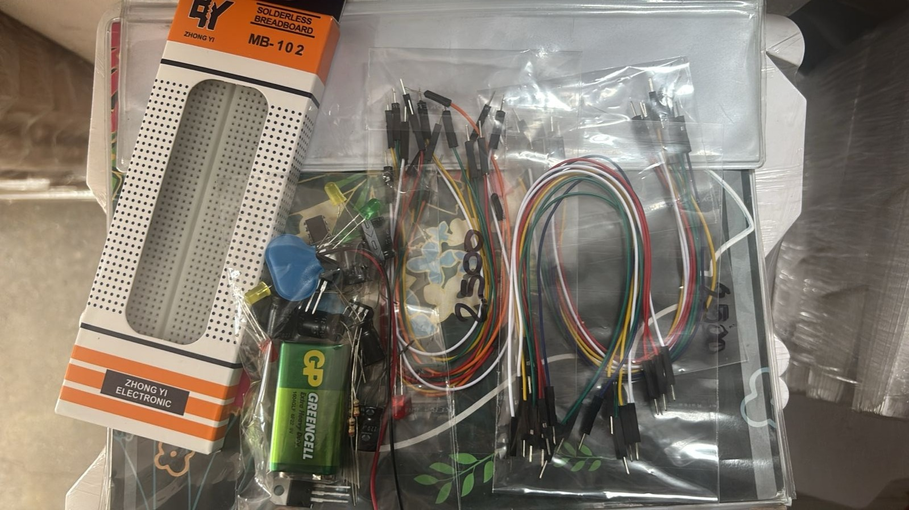
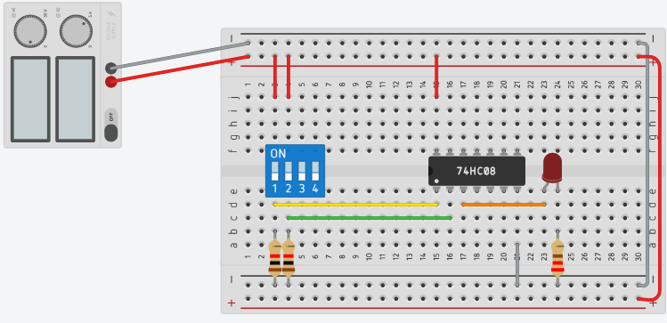

# Laboratorio-sistemas-digitales-KRKT
Repositorio con el paso a paso del laboratorio en clase de sistemas digitales 
---
---
---
# Laboratorio 1 - Sistemas Digitales
Fundación Universitaria Compensar

Estudiantes:

Karol Vanessa Rojas Gil

Kevin Alejandro Tacha Herrera

---

## Introducción

En este laboratorio se desarrolló un circuito digital con el objetivo de comprender el funcionamiento de compuertas lógicas y circuitos integrados.

Se implementó un circuito para generar una onda cuadrada de 2 segundos y se realizaron pruebas con compuertas lógicas utilizando circuitos integrados de la serie 74HC.

---

## Objetivo del laboratorio

Reconocer el funcionamiento de diferentes compuertas lógicas y analizar su comportamiento dentro de un circuito digital.

---

## Materiales utilizados

- Circuito integrado 74HC04
- Circuito integrado 74HC02
- Protoboard
- Bateria 9V
- LM 7806
- TL 555
- Bombillos LED
- Resistencias
- Capacitores
- Cables de conexión
- Fuente de alimentación
  

  <table>
<tr>
<td align="center">

 

</td>

<td align="center">

 

</td>
</tr>
</table>

---

## Paso a paso del laboratorio

### Paso 1: Análisis del circuito

Primero se analizó el circuito necesario para generar una onda cuadrada de 2 segundos.

Se identificaron los componentes necesarios para controlar el tiempo de oscilación.

---

### Paso 2: Cálculo de los componentes

Se calcularon los valores de resistencias y capacitores necesarios para generar el tiempo de 2 segundos en la señal.

---

### Paso 3: Montaje del circuito

Se realizó el montaje del circuito en una protoboard conectando:

- El circuito integrado
- Resistencias
- Capacitores
- Alimentación

---

### Paso 4: Pruebas del circuito

Se realizaron pruebas para verificar:

- Funcionamiento de la onda cuadrada
- Comportamiento de las compuertas lógicas
- Tiempo de la señal

---

### Compuerta AND – Integrado 74HC08

  

Pasos de Montaje:

1. Se conectó la fuente de alimentación de 5V a los rieles positivo y negativo de la protoboard.
2. Se colocó el circuito integrado 74HC08 en el centro de la protoboard para separar las dos mitades del circuito.
3. Se conectó el pin de alimentación del integrado al riel positivo y el pin de tierra al riel negativo.
4. Se utilizó un módulo de interruptores DIP para representar las entradas lógicas A y B.
5. Las salidas de los interruptores se conectaron a las entradas de la compuerta AND.
6. La salida de la compuerta se conectó a un LED para visualizar el resultado lógico.
7. Se agregó una resistencia en serie con el LED para limitar la corriente.
8. Se realizaron pruebas activando diferentes combinaciones de los interruptores para verificar el comportamiento de la compuerta.

  

---

## Resultados

El circuito logró generar una señal cuadrada con el tiempo esperado y permitió observar el comportamiento de las compuertas lógicas estudiadas.

---

## Conclusiones

El laboratorio permitió comprender el funcionamiento de los circuitos digitales y la aplicación de compuertas lógicas en la generación de señales.

---

## Prueba imagen num 1 (prueba)

  

