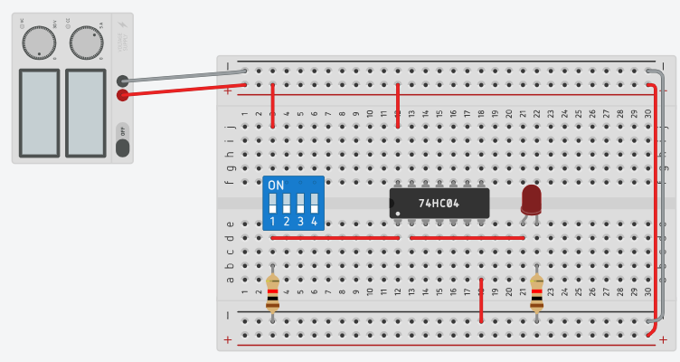
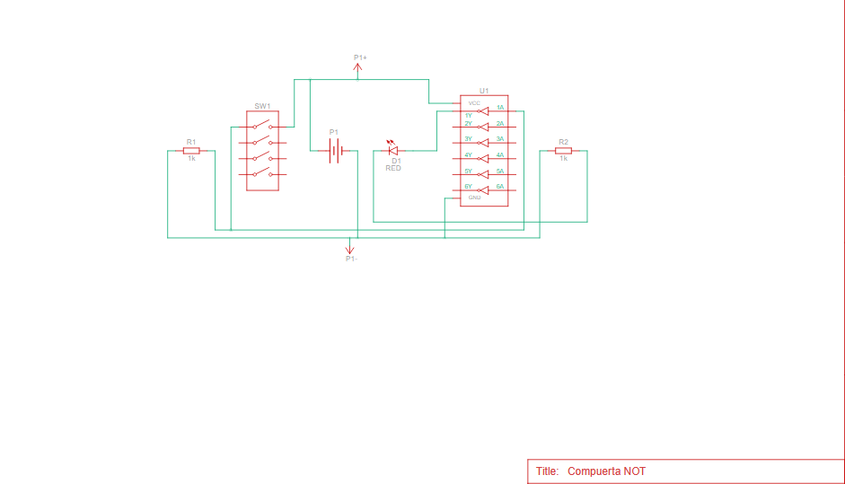

# LABORATORIO - SISTEMAS DIGITALES
Fundación Universitaria Compensar

Estudiantes:

Karol Vanessa Rojas Gil

Kevin Alejandro Tacha Herrera

---

# INTRODUCCIÓN

Los circuitos digitales constituyen una parte fundamental de la electrónica moderna, ya que permiten procesar información mediante señales binarias a través de diferentes dispositivos lógicos. Entre estos elementos se encuentran las compuertas lógicas y los circuitos temporizadores, los cuales son ampliamente utilizados para el control y generación de señales dentro de los sistemas electrónicos.

A partir de estos principios, se desarrollaron diferentes montajes con el fin de analizar el comportamiento de circuitos digitales básicos. Entre ellos se implementó un circuito capaz de generar una onda cuadrada con un período aproximado de 2 segundos y se realizaron pruebas con compuertas lógicas utilizando circuitos integrados de la serie 74HC. Estas actividades permitieron observar el funcionamiento de dichos componentes y comprender su aplicación dentro de sistemas electrónicos digitales.

---

# OBJETIVO GENERAL

Analizar el funcionamiento de circuitos digitales mediante la implementación de un generador de onda cuadrada y la experimentación con compuertas lógicas utilizando circuitos integrados de la serie 74HC, con el fin de comprender su comportamiento y verificar sus salidas lógicas.

---
# DESARROLLO DEL LABORATORIO

## Primer punto - Oscilador astable con temporizador TL555
En este primer punto se desarrolló un circuito oscilador multivibrador astable utilizando el temporizador TL555, con el objetivo de generar una señal de onda cuadrada con un período aproximado de 2 segundos.

### Materiales para la creacion del oscilador astable:

- Temporizafor TL555
- Protoboard
- Batería de 9 V
- Resistencias
- Capacitor
- Cables de conexión (jumpers)
- Osciloscopio
- Multímetro
  
  <table>
<tr>
<td align="center">

 

</td>

<td align="center">

 

</td>
</tr>
</table>

El montaje inicia con una fuente de alimentación de 9 V, la cual pasa a través de un regulador de voltaje LM7805. Este regulador se utiliza para estabilizar la tensión y suministrar 5 V constantes al circuito integrado TL555, garantizando un funcionamiento adecuado del temporizador.El TL555 se configuró en modo astable, lo que significa que el circuito genera una señal oscilante continua sin necesidad de una señal externa de activación. En esta configuración, el circuito alterna constantemente entre estados alto y bajo, produciendo una onda cuadrada en la salida.

El período de la señal generada dependio de los valores de las resistencias y el capacitor conectados al circuito. Estos componentes determinan el tiempo de carga y descarga del capacitor interno del temporizador, lo que controla la duración de los estados alto y bajo de la señal.

Para determinar el tiempo de oscilación del circuito se utilizo la expresión del temporizador 555 en configuración astable:

T = 0.693 (R_1 + 2R_2) C

donde T corresponde al período de la señal, R₁ y R₂ representan las resistencias del circuito y C el capacitor conectado al temporizador. A partir de esta relación se seleccionan los valores de los componentes para obtener un período cercano a 2 segundos, que corresponde al tiempo deseado para la onda cuadrada generada en el laboratorio.

Durante el funcionamiento del circuito, el capacitor se carga a través de las resistencias hasta alcanzar aproximadamente 2/3 del voltaje de alimentación, momento en el cual el temporizador cambia de estado y comienza el proceso de descarga hasta cerca de 1/3 del voltaje de alimentación. Este ciclo de carga y descarga se repite continuamente, generando la señal periódica observada en la salida del circuito.

Finalmente, el comportamiento de la señal fue verificado mediante instrumentos de medición como osciloscopio y multímetro, conectados al montaje realizado en la protoboard, permitiendo observar la forma de la onda cuadrada y comprobar el período aproximado de la señal generada.
[video

Como resultado, la salida del circuito produce una onda cuadrada periódica, la cual puede ser observada mediante instrumentos de medición como un osciloscopio o un multímetro, permitiendo verificar que el período de la señal se aproxima a los 2 segundos establecidos en el diseño del laboratorio.

[imagen oscilador

---

## Paso a paso del laboratorio

### Paso 1: Análisis del circuito

Primero se analizó el circuito necesario para generar una onda cuadrada de 2 segundos.

Se identificaron los componentes necesarios para controlar el tiempo de oscilación.

---

### Paso 2: Cálculo de los componentes

Se calcularon los valores de resistencias y capacitores necesarios para generar el tiempo de 2 segundos en la señal.

---

### Paso 3: Montaje del circuito

Se realizó el montaje del circuito en una protoboard conectando:

- El circuito integrado
- Resistencias
- Capacitores
- Alimentación

---

### Compuerta AND – Integrado 74HC08

  

Pasos de Montaje:

1. Se conectó la fuente de alimentación de 5V a los rieles positivo y negativo de la protoboard.
2. Se colocó el circuito integrado 74HC08 en el centro de la protoboard para separar las dos mitades del circuito.
3. Se conectó el pin de alimentación del integrado al riel positivo y el pin de tierra al riel negativo.
4. Se utilizó un módulo de interruptores DIP para representar las entradas lógicas A y B.
5. Las salidas de los interruptores se conectaron a las entradas de la compuerta AND.
6. La salida de la compuerta se conectó a un LED para visualizar el resultado lógico.
7. Se agregó una resistencia en serie con el LED para limitar la corriente.
8. Se realizaron pruebas activando diferentes combinaciones de los interruptores para verificar el comportamiento de la compuerta.

  

### Compuerta OR - Integrado 74HC32

Pasos de Montajee:

1. Se conectó la fuente de alimentación a la protoboard.
2. Se colocó el circuito integrado 74HC32 en la protoboard.
3. Se conectaron los pines de alimentación del integrado a los rieles de voltaje.
4. Se configuraron dos interruptores del DIP switch como entradas lógicas.
5. Cada interruptor se conectó a una de las entradas de la compuerta OR.
6. La salida de la compuerta se conectó a un LED indicador.
7. Se añadió una resistencia limitadora entre el LED y tierra.
8. Se probaron diferentes combinaciones de entrada para comprobar el funcionamiento de la compuerta OR.

  

### Compuerta NOT - Integrado 74HC04

Pasos de Montaje:

1. Se conectó la fuente de alimentación de 5V a la protoboard.
2. Se colocó el circuito integrado 74HC04 en la protoboard.
3. Se conectaron los pines de alimentación del integrado a los rieles de energía.
4. Se utilizó un interruptor del DIP switch como entrada lógica.
5. La entrada se conectó al pin de entrada de una de las compuertas NOT.
6. La salida de la compuerta se conectó a un LED para observar el resultado.
7. Se agregó una resistencia limitadora para proteger el LED.
8. Se verificó que cuando la entrada está en nivel alto el LED se apaga y cuando está en nivel bajo el LED se enciende.

---

### Paso 4: Pruebas del circuito

Se realizaron pruebas para verificar:

- Funcionamiento de la onda cuadrada
- Comportamiento de las compuertas lógicas
- Tiempo de la señal
  
---

## Resultados

El circuito logró generar una señal cuadrada con el tiempo esperado y permitió observar el comportamiento de las compuertas lógicas estudiadas.

---

## Conclusiones

El laboratorio permitió comprender el funcionamiento de los circuitos digitales y la aplicación de compuertas lógicas en la generación de señales.

---
---
---
